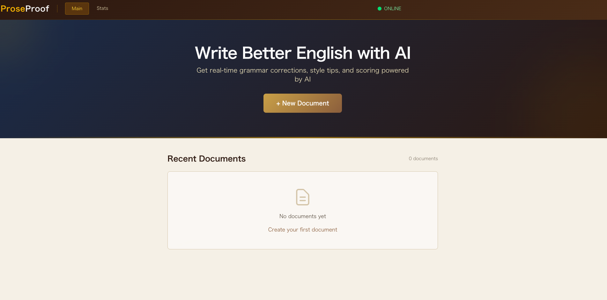

# ProseProof

**Note** This project was created via vibe coding using a local LLM (Qwen 3.5-27B, `Jackrong/Qwen3.5-27B-Claude-4.6-Opus-Reasoning-Distilled-GGUF`) in OpenCode.

An AI-powered writing assistant that provides real-time grammar corrections, style tips, and scoring powered by local AI.

<div align="center">
 
</div>

## Features

- **AI-Powered Grammar Checking**: Real-time grammar and style corrections
- **Writing Score**: Get a score from 1-10 for your writing quality
- **Style Tips**: Personalized tips to improve your writing
- **Document Management**: Save, edit, and delete your documents
- **Statistics**: Track your writing progress over time

## Tech Stack

- **Frontend**: React + TypeScript + Vite + Tailwind CSS v4
- **Backend**: FastAPI + SQLite
- **AI**: Ollama (local LLM - default: gemma3:4b, configurable)

## Quick Start

### Prerequisites

- Node.js 18+
- Python 3.10+
- Ollama installed and running

### 1. Install Ollama and Download Model

```bash
# Install Ollama (if not already installed)
# macOS
brew install ollama

# Or visit https://ollama.ai for other platforms

# Download a model (default: gemma3:4b)
ollama pull gemma3:4b

# Or any other Ollama model:
# ollama pull llama3.2
# ollama pull mistral
# ollama pull codellama
```

**Note:** You can use any model available on [Ollama](https://ollama.ai/library). Change the model by setting `OLLAMA_MODEL` in `.env`.

### 2. Clone the Repository

```bash
git clone <repository-url>
cd proseproof
```

### 3. (Optional) Configure Environment Variables

Copy the example environment file and customize if needed:

```bash
cp .env.example .env
```

Edit `.env` to change default settings:

```bash
# Backend port (default: 18001)
BACKEND_PORT=18001

# Frontend port (default: 15174)
FRONTEND_PORT=15174
```

### 4. Run the Application (Background Mode)

**Launch all services:**

```bash
chmod +x launch-all.sh stop-all.sh
./launch-all.sh
```

**Stop all services:**

```bash
./stop-all.sh
```

**View logs:**

```bash
tail -f logs/backend.log logs/frontend.log
```

The application will be available at:

- **Frontend**: `http://localhost:15174`
- **Backend**: `http://localhost:18001`

---

### Alternative: Manual Setup (Development)

For more control, you can run services manually:

**Backend:**

```bash
cd backend

# Install dependencies with uv (creates .venv automatically)
uv sync

# Activate virtual environment
# macOS/Linux
source .venv/bin/activate

# Windows
.venv\Scripts\activate

# Run the backend
uvicorn app.main:app --app-dir . --host 0.0.0.0 --port 18001
```

**Frontend** (new terminal):

```bash
cd frontend

# Install dependencies
npm install

# Run the frontend
npm run dev -- --port 15174
```

## Configuration

### Environment Variables (Recommended)

The application uses environment variables for configuration. Create a `.env` file in the project root:

```bash
# Backend Configuration
BACKEND_PORT=18001
BACKEND_HOST=0.0.0.0
BACKEND_URL=http://localhost:18001

# Frontend Configuration
FRONTEND_PORT=15174

# Ollama Configuration
OLLAMA_BASE_URL=http://localhost:11434
OLLAMA_MODEL=gemma3:4b          # Can use any model: llama3.2, mistral, codellama, etc.
```

**Important:** `BACKEND_URL` is automatically set by `launch-all.sh` based on `BACKEND_PORT`. You typically don't need to modify it manually.

**Browse available models:** Visit the [Ollama Library](https://ollama.ai/library) to discover all supported models.

### Configuration Priority

The application uses a **priority-based configuration system**:

1. **Environment Variables** (highest priority) - Set via `.env` file or command line
2. **YAML Configuration** (fallback) - `backend/config/app.yaml`

If a setting exists in both places, the environment variable takes precedence.

### Backend Configuration

The YAML file (`backend/config/app.yaml`) contains **fallback defaults** that are only used when environment variables are not set:

```yaml
# Application settings
app:
  name: "ProseProof"
  debug: true
  host: "0.0.0.0"
  port: 8000 # Only used if BACKEND_PORT env var is not set

# Database settings
database:
  url: "sqlite:///./documents.db"
  echo: false

# Ollama AI settings
ollama:
  base_url: "http://localhost:11434"
  model: "gemma3:4b"
  timeout: 120
  temperature: 0.3
  max_retries: 3
```

**Note:** The port `8000` in YAML is just a fallback. The actual default is `18001` from `.env`.

### Override Ports Temporarily

You can override ports without modifying `.env`:

```bash
BACKEND_PORT=3000 ./launch-all.sh
```

## Project Structure

```
proseproof/
├── backend/
│   ├── app/
│   │   ├── main.py              # FastAPI entry point
│   │   ├── config.py            # Configuration loader
│   │   ├── database.py          # Database setup
│   │   ├── models/
│   │   │   └── document.py      # Document model
│   │   ├── services/
│   │   │   └── ai_service.py    # AI analysis service
│   │   └── routes/
│   │       ├── documents.py     # Document CRUD endpoints
│   │       ├── analysis.py      # Analysis endpoint
│   │       ├── health.py        # Health check endpoint
│   │       └── stats.py         # Statistics endpoint
│   └── config/
│       └── app.yaml             # Application configuration
├── frontend/
│   ├── src/
│   │   ├── App.tsx              # Main app component
│   │   ├── main.tsx             # Entry point
│   │   ├── index.css            # Styles
│   │   ├── components/
│   │   │   ├── layout/
│   │   │   │   └── Header.tsx   # Header component
│   │   │   ├── pages/
│   │   │   │   ├── StartupPage.tsx
│   │   │   │   ├── MainPage.tsx
│   │   │   │   └── StatsPage.tsx
│   │   │   └── common/
│   │   │       ├── FAB.tsx      # Floating action button
│   │   │       ├── ScoreDisplay.tsx
│   │   │       └── ConfirmDialog.tsx
│   │   ├── hooks/
│   │   │   ├── useDocuments.ts
│   │   │   ├── useAnalysis.ts
│   │   │   └── useAutoSave.ts
│   │   ├── services/
│   │   │   └── api.ts           # API service
│   │   └── types/
│   │       └── index.ts         # TypeScript types
│   ├── package.json
│   ├── vite.config.ts
│   └── tsconfig.json
├── .gitignore
└── README.md
```

## API Endpoints

### Documents

- `GET /api/documents` - List all documents
- `POST /api/documents` - Create a new document
- `GET /api/documents/{id}` - Get a document by ID
- `PUT /api/documents/{id}` - Update a document
- `DELETE /api/documents/{id}` - Delete a document

### Analysis

- `POST /api/analyze` - Analyze text for grammar and style

### Health

- `GET /api/health` - Check Ollama connectivity

### Statistics

- `GET /api/stats` - Get user statistics

## Keyboard Shortcuts

- `Ctrl+S` / `Cmd+S` - Proofread text

## License

MIT
